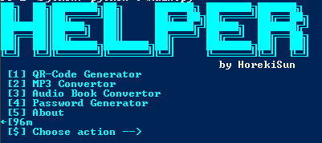
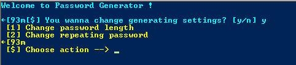
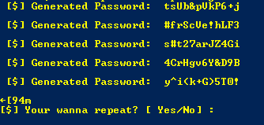

<h1 align="center">Helper</h1>

<h4 align="center">
  <a href="https://t.me/horekisun">Telegram</a>
  <a href="https://github.com/TheDmitryY/MultiMenu">MultiMenu</a>
</h4>

<p align="center">
Helper is a console program that helps manage the system, which has built-in utilities.We support user ratings and ideas. You can write to us in case of an idea, and other useful.
</p>

## 👀 Preview





## ✨ Features
- Password Generator
- Useful utulites
- Work with your files

 ## 🌟 Installation

 ```sh
git clone https://github.com/TheDmitryY/Helper
```
